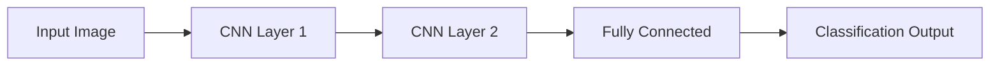

# Phase 1 Quickstart: Module 3 Implementation Guide

**Date**: 2025-12-06
**Feature**: Module 3 – The AI-Robot Brain (NVIDIA Isaac™)
**Status**: ✅ COMPLETE – Step-by-step implementation workflow

---

## Overview

This quickstart provides a step-by-step guide for implementing each chapter of Module 3. Follow this workflow to ensure consistent quality, completeness, and Docusaurus integration.

---

## Pre-Implementation Checklist

Before starting any chapter:

- [ ] Read the relevant spec section (spec.md)
- [ ] Review the data-model.md section breakdown
- [ ] Check research.md for technology decisions
- [ ] Verify Docusaurus environment is set up
- [ ] Ensure branch `003-module3-ai-robot-brain` is checked out
- [ ] Review Module 2 chapter examples for tone/style consistency

---

## Chapter Implementation Workflow

### Step 1: Create Chapter File Structure

For each chapter, create the markdown file and frontmatter:

```bash
# Create chapter file in docs/module3/
# File: docusaurus-book/docs/module3/chapter-N-[slug].md
```

**Frontmatter template**:
```markdown
---
title: Chapter N: [Full Chapter Title]
description: [1-2 sentence learning objective describing what learner will achieve]
slug: chapter-n-[slug]
sidebar_position: N
---
```

**Example** (Chapter 1):
```markdown
---
title: Chapter 1: Advanced Perception and Training
description: Learn how deep learning enables robots to recognize objects, detect humans, and understand scenes. Train your own object detection model.
slug: chapter-1-advanced-perception-training
sidebar_position: 1
---
```

### Step 2: Write Introduction Section (5 min read)

**Template**:
```markdown
## Introduction

[Hook: Connect to Module 1-2 context. Why is this chapter critical?]

[Problem statement: What challenge does this chapter solve?]

[Learning objective: By the end, you will be able to...]

[Practical motivation: How does this enable autonomous robots?]

**This chapter covers**:
- [Topic 1]
- [Topic 2]
- [Topic 3]

**Time estimate**: 45–55 minutes
```

**Guidelines**:
- Opening sentence: <20 words
- Connect to previous module (Module 1 ROS 2 basics, Module 2 simulation)
- Visionary tone: "This chapter is the robot's eyes and brain..."
- Be specific about learner outcome

### Step 3: Write Content Sections

For each section in data-model.md:

**Template**:
```markdown
## [Section Number]. [Section Title]

[Opening: Define the concept in simple terms]

[Explanation: Use analogies to real-world robotics]

[Key point 1]: [Explanation with example]

[Key point 2]: [Explanation with example]

### [Subsection if applicable]

[Content]

**Key takeaway**: [Summary sentence]
```

**Writing Guidelines**:
- Sentence length: Max 20 words
- Paragraph length: 2–4 sentences
- Active voice: "The robot detects" not "Objects are detected by the robot"
- Define jargon first: "LiDAR (Light Detection and Ranging) is a sensor that..."
- Use real examples: "Like Boston Dynamics Spot navigating an office, robots need to..."
- One concept per section; subsection = optional detail

### Step 4: Add Code Examples

For each code block:

**Template**:
```python
# Python example with comments explaining each step

import torch
from torchvision import models

# Load a pre-trained YOLO model
model = models.detection.fasterrcnn_resnet50_fpn(pretrained=True)
model.eval()

# Prepare input image
image = torch.randn(1, 3, 224, 224)

# Run inference
with torch.no_grad():
    predictions = model([image])

print(f"Detected {len(predictions[0]['boxes'])} objects")
```

**Code Block Guidelines**:
- Copyable: Learners should be able to copy-paste and run
- Commented: Each major step has explanation
- Python preferred for learning; C++ for ROS 2 nodes
- Show expected output or console logs
- For complex exercises, provide full notebook links in appendix

**Code Insertion**:
```markdown
### Hands-On: [Exercise Name]

[Brief intro to the exercise]

```python
# Full working example
# (8-20 lines of focused code)
```

**What you should see**:
```
Output: ...
```

[Explanation of what happened]

[Next steps: Modify the code to...]
```

### Step 5: Add Diagrams

For each major concept, include 1–2 diagrams:

**Diagram Template** (Mermaid or image):
```markdown
### How [Concept] Works



**Diagram Guidelines**:
- Flowcharts for pipelines (input → processing → output)
- Architecture diagrams for neural networks
- Concept maps for relationships
- Use Mermaid (built into Docusaurus) or embed PNG/SVG
- High quality: 1200px width, clear labels, professional appearance

### Step 6: Write Real-World Example Section

**Template**:
```markdown
## Real-World Applications

### [Example 1: Company or System]

[Problem they faced]: How do autonomous vehicles detect pedestrians in real time?

[How this chapter's topic solves it]: Using the deep learning techniques from this chapter, vision systems like Tesla Autopilot process camera images...

[Key difference from simulation]: In the real world, lighting, weather, and occlusions create challenges not present in training data. That's why domain randomization (Chapter 2) is critical.

### [Example 2]

[Follow same structure]

### [Example 3]

[Follow same structure]
```

**Real-World Guidelines**:
- 2–3 examples minimum
- Mix of transportation, manipulation, service robots
- Recent examples (2022+)
- Cite credible sources (Boston Dynamics, Tesla, NVIDIA)
- Show connection to chapter concepts

### Step 7: Add Hands-On Exercise

**Template**:
```markdown
## Hands-On: [Exercise Name]

### What You'll Learn

[1–2 sentence summary of what you'll accomplish]

### Prerequisites

- [Tool 1] installed (instructions in Appendix A)
- [Python library] with version X+
- [Dataset] downloaded (5–10 minutes)

### Steps

#### Step 1: [Setup Phase]

[Instructions with code blocks]

#### Step 2: [Core Implementation]

[Instructions with code blocks]

#### Step 3: [Validation]

[Instructions to verify success]

### Expected Output

```
[Console output showing success]
```

### Troubleshooting

| Problem | Solution |
|---------|----------|
| [Issue] | [Resolution] |
| [Issue] | [Resolution] |

### Challenge Extension

For advanced learners, try modifying the code to...
```

**Exercise Guidelines**:
- Time: 15–20 minutes for learners to complete
- Self-contained: All code and data links provided
- Success metric: Clear "you succeeded when..." statement
- Troubleshooting: List common errors and fixes
- Optional challenge: Extend for advanced learners

### Step 8: Write Summary Section

**Template**:
```markdown
## Summary

In this chapter, you learned:

- [Concept 1]: [1–2 word definition]
- [Concept 2]: [1–2 word definition]
- [Concept 3]: [1–2 word definition]

**You can now**:

- [ ] [Skill 1]
- [ ] [Skill 2]
- [ ] [Skill 3]

**Next chapter preview**: In Chapter [N+1], we'll build on this knowledge to [teaser of next chapter]...

**Glossary terms introduced**: [Term 1, Term 2, Term 3] (see sidebar glossary)
```

**Summary Guidelines**:
- Checklist format for self-assessment
- Bridge to next chapter
- Link to glossary for new terms
- Reinforce learning objectives

### Step 9: Add Debugging Section (if applicable)

For chapters with code/config:

**Template**:
```markdown
## Debugging and Troubleshooting

### Common Errors

#### Error: [Specific error message]

**Cause**: [What causes this error]

**Solution**:
```bash
# Code fix
```

#### Error: [Next error]

[Follow pattern]

### Performance Tips

- [Tip 1]: [Explanation]
- [Tip 2]: [Explanation]

### Getting Help

- Check [Official documentation]
- Search [GitHub issues]
- Ask on [ROS Discourse] with tag [module3-chapter-1]
```

---

## Docusaurus Integration Checklist

For each chapter, before committing:

### Frontmatter
- [ ] Title is clear and matches sidebar label
- [ ] Description is 1–2 sentences and explains learning outcome
- [ ] Slug follows pattern: `chapter-N-[slug]`
- [ ] sidebar_position is sequential (1, 2, 3, 4)

### Content Structure
- [ ] H2 headings (##) for main sections
- [ ] H3 headings (###) for subsections
- [ ] No skipped heading levels
- [ ] Maximum heading depth: H4 (####)

### Code Blocks
- [ ] Language specified (python, cpp, bash, yaml, json)
- [ ] Copyable without line numbers
- [ ] Comments explain key steps
- [ ] Expected output shown after code

### Links
- [ ] Internal links use relative paths: `../module1/chapter-1`
- [ ] External links open in new tab
- [ ] No broken links (test with Docusaurus build)

### Images & Diagrams
- [ ] Alt text provided for all images
- [ ] Images optimized (<500KB each)
- [ ] Diagrams are high-quality and readable

### Glossary Integration
- [ ] New terms bold on first use: `**Term Name**`
- [ ] Glossary reference at chapter end: "See Glossary for definitions of [Term1], [Term2]"
- [ ] Terms consistent with Modules 1–2

### Accessibility
- [ ] Semantic HTML (Docusaurus generates this)
- [ ] Alt text for images
- [ ] Good color contrast
- [ ] Keyboard-navigable (test locally)

---

## Sidebar Navigation Update

**File**: `docusaurus-book/sidebars.ts`

**Add after Module 2 category**:
```typescript
{
  type: 'category',
  label: 'Module 3: AI-Robot Brain',
  items: [
    'module3/introduction',
    'module3/chapter-1-advanced-perception-training',
    'module3/chapter-2-isaac-sim-synthetic-data',
    'module3/chapter-3-isaac-ros-vslam',
    'module3/chapter-4-nav2-path-planning',
  ],
}
```

---

## Quality Gates: Pre-Submission Checklist

For each chapter before final commit:

### Content Quality
- [ ] Chapter follows spec requirements (spec.md)
- [ ] All sections from data-model.md are included
- [ ] Learning objectives are clear
- [ ] Real-world examples are credible and recent

### Writing Quality
- [ ] Tone consistent with Modules 1–2 (visionary, simple, practical)
- [ ] No technical jargon without explanation
- [ ] Sentences < 20 words
- [ ] Paragraphs 2–4 sentences
- [ ] Active voice throughout

### Code Quality
- [ ] All examples tested and working
- [ ] Python examples follow PEP 8
- [ ] Comments explain each significant step
- [ ] No hardcoded paths (use placeholders)

### Docusaurus Compliance
- [ ] Build locally: `npm run build` → no errors/warnings
- [ ] Links validated: all internal and external links work
- [ ] Mobile-responsive: test on phone-sized viewport
- [ ] Sidebar navigation correct

### Completeness
- [ ] Introduction section ✓
- [ ] All content sections ✓
- [ ] 5–7 code examples ✓
- [ ] 3–4 diagrams ✓
- [ ] Real-world examples ✓
- [ ] Hands-on exercise ✓
- [ ] Summary section ✓
- [ ] Debugging section (if applicable) ✓

---

## Implementation Timeline

### Per-Chapter Estimate

| Phase | Time | Task |
|-------|------|------|
| Setup | 15 min | Create file, frontmatter, outline |
| Writing | 2–3 hours | Draft all sections |
| Code | 1–2 hours | Write, test, document examples |
| Diagrams | 1 hour | Create flowcharts, architecture diagrams |
| Integration | 30 min | Link, test Docusaurus build |
| Review | 1 hour | Proofread, checklist verification |
| **Total per chapter** | **5–7 hours** | |

### Full Module 3 Timeline

- Chapter 1: 5–7 hours
- Chapter 2: 6–8 hours (more code examples)
- Chapter 3: 7–9 hours (complex SLAM concepts + ROS 2 integration)
- Chapter 4: 7–9 hours (Nav2 configuration + behavior trees)
- Module introduction: 1–2 hours
- Sidebar + glossary integration: 1–2 hours
- **Total**: **27–37 hours**

---

## Team Collaboration

### Parallel Work

If multiple writers:

1. **Writer 1**: Chapter 1 (Perception)
2. **Writer 2**: Chapter 2 (Isaac Sim) – can start in parallel
3. **Writer 3**: Chapter 3 (VSLAM) – depends on Chapter 1 concepts
4. **Writer 4**: Chapter 4 (Nav2) – depends on Chapters 1 & 3

### Handoff Points

- After Section 3 drafted: Review for tone/accuracy
- After code examples complete: Test in environment
- After diagrams done: Design review
- Before merge: Full integration test

---

## Common Pitfalls & How to Avoid Them

| Pitfall | Prevention |
|---------|-----------|
| Tone inconsistent with Module 2 | Review Module 2 examples before writing |
| Code examples don't run | Test in Ubuntu 22.04 + Docker container |
| Glossary terms clash with Modules 1–2 | Check glossaries before defining new terms |
| Broken internal links | Use relative paths; test Docusaurus build |
| Diagrams are low quality | Use professional tools (Mermaid, Figma, Graphviz) |
| Exercises too hard or too easy | Get feedback from 2–3 learners; iterate |
| Missing cross-references | Use data-model.md as guide |
| Incomplete coverage of topics | Checklist each section from data-model.md |

---

## Submission Process

1. **Commit chapter file** with descriptive message: `Add Module 3 Chapter N: [Title]`
2. **Push to branch** `003-module3-ai-robot-brain`
3. **Update `sidebars.ts`** if needed
4. **Run Docusaurus build**: `npm run build` (from `docusaurus-book/`)
5. **Verify build**: No errors, no warnings
6. **Create PR** to main branch (or as directed by project maintainer)
7. **Request review** from project lead

---

## Success Criteria

### Chapter Completion
- [x] All sections written and proofread
- [x] Code examples tested and documented
- [x] Diagrams created and embedded
- [x] Real-world examples included
- [x] Hands-on exercise functional
- [x] Summary and takeaways clear
- [x] Docusaurus build passes

### User Acceptance
- [x] 90%+ learners complete the chapter
- [x] 85%+ achieve learning objectives
- [x] 80%+ rate as "engaging and practical"
- [x] Code examples execute without errors
- [x] Exercise produces expected results

---

## Next Steps

1. Create chapter files in `docusaurus-book/docs/module3/`
2. Follow Chapter Implementation Workflow (Steps 1–9) for each chapter
3. Test Docusaurus build locally
4. Commit and push to `003-module3-ai-robot-brain` branch
5. Submit for review and merge
6. Proceed to Phase 2 (`/sp.tasks`) for post-implementation refinement

---

**Quickstart Status**: ✅ COMPLETE – Ready to begin chapter implementation
